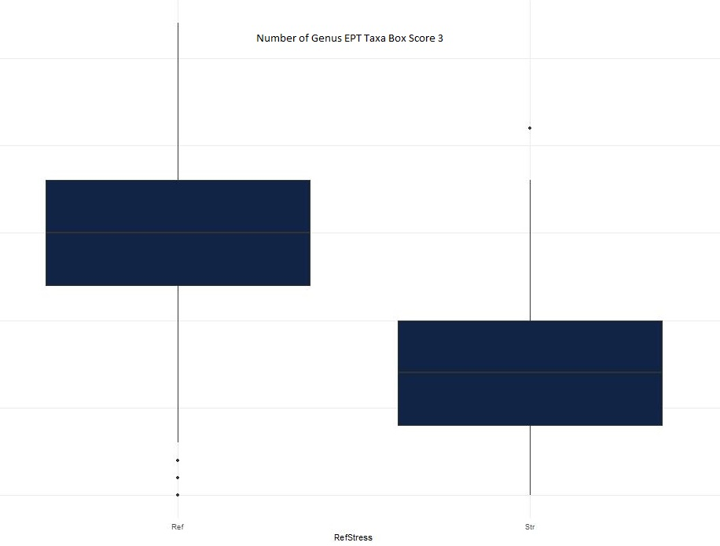
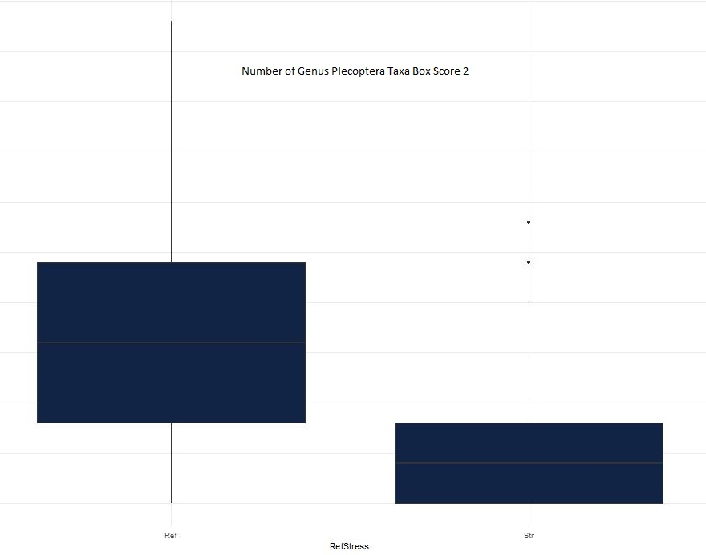
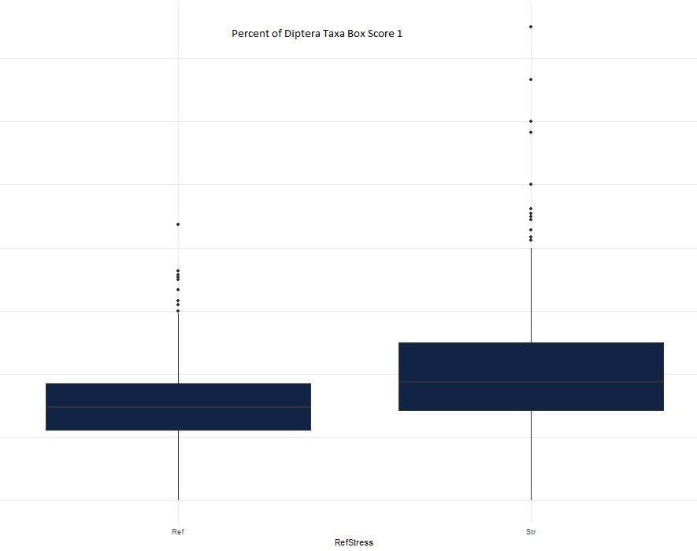
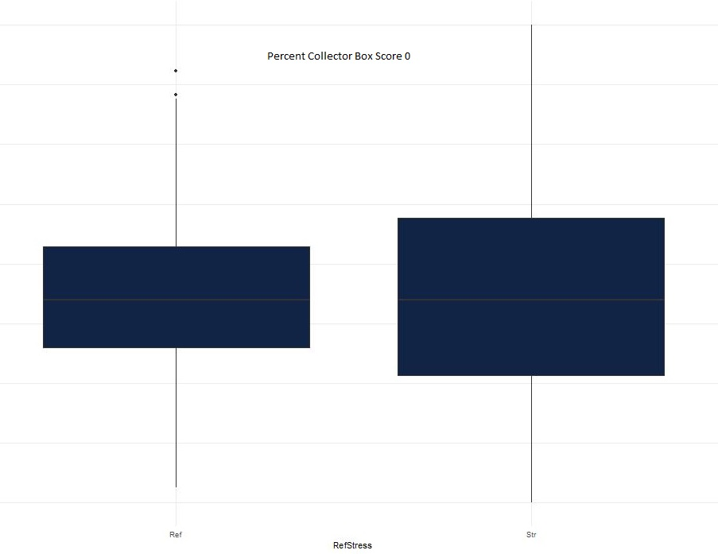

```{r setup, include=FALSE, message = FALSE, warning = FALSE}
knitr::opts_chunk$set(echo = FALSE)

```

```{r message = FALSE, warning = FALSE}
library(readxl)
library(tidyverse)
library(tidyr)
library(DT)
library(sf)
library(inlmisc)
library(leaflet)

# Set working directory

setwd('C:/Users/ktq89598/Documents/EmmaMetricsBoxPlot/Richards_Metric_Reduction_Code/')
```


# Overview

This script was built using R 4.1.2 (Bird Hippie). 

This document describes the process undertaken to identify the best metrics for use in genus IBI development. After metric reducing steps, as described in the document were performed, 77 metrics were identified for use in the coastal region and 94 metrics in the non-coastal region of Virginia. Further metric reduction may take place during the all-subset calculations and will be noted at the end of this document and in the all-subset Rmarkdown. The all-subset method will be used to develop the genus IBI candidate models for Virginia biologists to consider for different bioregions, seasons and stream sizes.

Metric reduction steps and all-subset methodologies employed in this document are found in the following literature:

Blocksom, K.A. and B.R. Johnson. 2009. Development of a Regional Macroinvertebrate Index for Large River Bioassessment. Ecological Indicators. Elsevier Science Ltd, New York, NY, 9(2):313-328.

Carlisle, Daren & Spaulding, Sarah & Polaskey, Meredith & Schulte, Nicholas & Lee, Sylvia & Mitchell, Richard & Pollard, Amina. (2022). A web-based tool for assessing the condition of benthic diatom assemblages in streams and rivers of the conterminous United States. Ecological Indicators. 135. 108513. 10.1016/j.ecolind.2021.108513.

Klemm, Donald & Blocksom, Karen & Fulk, Florence & Herlihy, Alan & Hughes, Robert & Kaufmann, Philip & Peck, David & Stoddard, John & Thoeny, William & Griffith, Michael & Davis, Wayne. (2003). Development and Evaluation of a Macroinvertebrate Biotic Integrity Index (MBII) for Regionally Assessing Mid-Atlantic Highland Streams. Environmental management. 31. 656-69.


VDEQ used four steps to reduce metrics (using metric evaluation R code from EPA), the first step was to run box score comparison (and remove all metrics that scored 0 and 1 and keep all metrics that scored 2 and 3, examples of box score comparison are below), the second step was to run a range test (to remove metrics with low range - these are metrics that often have a lot of zeros, hence the low range), the third step was to run a correlation matrix to identify any metrics that were highly correlated (there were many with 100% correlation that were removed and are listed in a table below, all other metrics were kept as the box comparison and range test removed many metrics). The fourth test run was to compared metrics by sample method (riffle collection vs multihabitat sampling), any metrics that were skewed by sample method were removed in order to allow the biologists to choose the best sample method in the field and know that metrics selected for the genus IBI models will work appropriately. 

# Box Comparison Examples

```{r box, echo=FALSE, fig.cap="Box Score of 3 – interquartile ranges (75th-25th percentile) of reference sites do not overlap with interquartile ranges of stress sites (keep these!)", out.width = '100%'}

```

```{r box1, echo=FALSE, fig.cap="Box Score of 2 – Interquartile Ranges (75th-25th percentile) of reference sites do overlap with interquartile ranges of stress sites, however the median of reference sites do not overlap with interquartile range of stress sites (keepers!)", out.width = '100%'}

```

```{r box2, echo=FALSE, fig.cap="Box Score of 1 – Interquartile Ranges (75th-25th percentile) of reference sites do overlap with interquartile ranges of stress sites, and the median of reference sites also overlap with interquartile range of stress sites (not a keeper!)", out.width = '100%'}

```

```{r box3, echo=FALSE, fig.cap="Box Score of 0 – Interquartile Ranges (75th-25th percentile) of reference sites do overlap with interquartile ranges of stress sites, and the median of reference sites also overlap with interquartile range of stress sites, and median of reference sites is not different from the median of stress sites (not a keeper!)", out.width = '100%'}

```

********
# Coastal Box Comparison Results (step 1)

This tables shows all the coastal bioregion box comparison results. If the box comparison scores by all data, just coastal data, coast spring and coast fall added up to less than 7 these metrics were removed for further consideration. Special emphasis was place on coastal results, no metrics that scored a three by any coast category was removed.

```{r, warning=FALSE, coastBox}
## Load data
coastBox <- read_excel('Output/zBoxScore_Comparison.xlsx', sheet='Results_Combined_CoastR')

datatable(coastBox, rownames = F, escape= F, extensions = 'Buttons',
                options = list(dom = 'Bift', scrollX= TRUE, scrollY = '300px',
                               pageLength = nrow(coastBox), buttons=list('copy','colvis', 'excel')))

```

# Non-Coastal Box Comparison Results (step 1)

This tables shows all the non-coastal bioregion box comparison results. If the box comparison scores by all data,  non-coastal data, non-coast spring, non-coast fall, non-coast spring mountain bioregion, non-coast fall mountain bioregion, non-coast spring piedmont bioregion, non-coast fall piedmont bioregion added up to less than 6 these metrics were removed for further consideration.

```{r, warning=FALSE, noncoastBox}
## Load data
noncoastBox <- read_excel('Output/zBoxScore_Comparison.xlsx', sheet='Results_Combined_NonCoastR')

datatable(noncoastBox, rownames = F, escape= F, extensions = 'Buttons',
                options = list(dom = 'Bift', scrollX= TRUE, scrollY = '300px',
                               pageLength = nrow(noncoastBox), buttons=list('copy','colvis', 'excel')))
```

# Coastal Range Test Results (step 2)

This tables shows all the coastal metrics range test results after removing the metrics that failed the box comparison. Three metrics failed the range test in the coastal plain (Plecoptera Number of Taxa, Percent Plecoptera Taxa, and Percent of Plecoptera individuals).

```{r, warning=FALSE, coastRange}
## Load data
RangeCoast <- read_excel('Output/zBoxScore_Comparison.xlsx', sheet='RangeCoast')

datatable(RangeCoast, rownames = F, escape= F, extensions = 'Buttons',
                options = list(dom = 'Bift', scrollX= TRUE, scrollY = '300px',
                               pageLength = nrow(RangeCoast), buttons=list('copy','colvis', 'excel')))

```

# Non-Coastal Range Test Results (step 2)

This tables shows all the non-coastal metrics range test results after removing the metrics that failed the box comparison. No metrics failed the range test in the remaining non-coastal metrics.

```{r, warning=FALSE, noncoastRange}
## Load data
RangeNoCoast <- read_excel('Output/zBoxScore_Comparison.xlsx', sheet='RangeNoCoast')

datatable(RangeNoCoast, rownames = F, escape= F, extensions = 'Buttons',
                options = list(dom = 'Bift', scrollX= TRUE, scrollY = '300px',
                               pageLength = nrow(RangeNoCoast), buttons=list('copy','colvis', 'excel')))

```


# All Metrics Correlation Test Results (step 3)

This table shows all the metrics that were 100% correlated and therefore removed from the analysis. Should have started with this step, but better late than never. After removing all these metrics with 100% correlation, low box comparison score metrics and metrics that failed the range test, all metrics were re-ran with a 0.8 correlation cutoff. There were still several intercorrelated metrics left in the the coast and non-coast metrics list, however enough metrics had been removed by steps 1, 2, and 4 to move forward and decided to let the all subset approach select the best uncorrelated IBIs for final model selection.

```{r, warning=FALSE, corr100}
## Load data
corr100 <- read_excel('Output/zBoxScore_Comparison.xlsx', sheet='Redundancy_Analysis_All_Lou')

datatable(corr100, rownames = F, escape= F, extensions = 'Buttons',
                options = list(dom = 'Bift', scrollX= TRUE, scrollY = '300px',
                               pageLength = nrow(corr100), buttons=list('copy','colvis', 'excel')))

```

# Remove Metrics Skewed by Sample Method (step 4)

This table shows the metrics that were most significantly impacted by collection method (riffle vs multihabitat). Used box score comparison that looked at all the reference sites with different sample methods, all metrics that scored a 3 were removed from further consideration.

```{r, warning=FALSE, sampleMethod}
## Load data
sampleMethod <- read_excel('Output/zBoxScore_Comparison.xlsx', sheet='MethodsResults')

datatable(sampleMethod, rownames = F, escape= F, extensions = 'Buttons',
                options = list(dom = 'Bift', scrollX= TRUE, scrollY = '300px',
                               pageLength = nrow(sampleMethod), buttons=list('copy','colvis', 'excel')))

```


